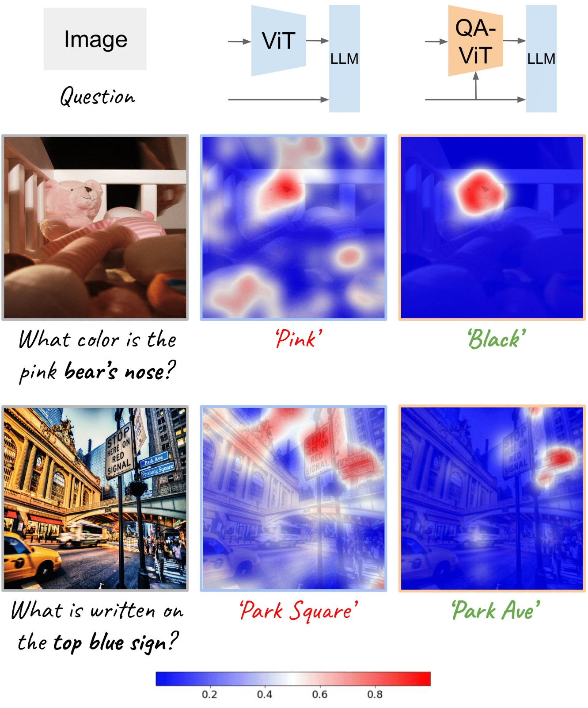

<h1 align="center">
  <br>
Question Aware Vision Transformer for Multimodal Reasoning
  <br>
</h1>
<p align="center">
  <a href="https://royg27.github.io/">Roy Ganz</a> •
  <a href="https://www.amazon.science/author/yair-kittenplon">Yair Kittenplon</a> •
  <a href="https://www.amazon.science/author/aviad-aberdam">Aviad Aberdam</a> •
  <a href="https://www.amazon.science/author/elad-ben-avraham">Elad Ben Avraham</a>
  <p align="center">
  <a href="https://www.amazon.science/author/oren-nuriel">Oren Nuriel</a> •
  <a href="https://www.amazon.science/author/shai-mazor">Shai Mazor</a> •
  <a href="https://www.amazon.science/author/ron-litman">Ron Litman</a>
</p>

<p align="center">
  
</p>

### Installation

First, clone this repository:

```bash
git clone https://github.com/amazon-science/QA-ViT.git
cd QA-ViT
```

Next, to install the requirements in a new conda environment, run:

```bash
conda env create -f qavit.yml
conda activate qavit
```

### Data preparation 

Download the following datasets from the official websites, and organize them as follows:


    QA-ViT
    ├── configs
    │   ├── ...
    ├── data
    │   ├── textvqa
    │   ├── stvqa
    │   ├── OCRVQA
    │   ├── vqav2
    │   ├── vg
    │   ├── textcaps
    │   ├── docvqa
    │   ├── infovqa
    │   ├── vizwiz
    ├── models
    │   ├── ...
    ├── ...


### DeepSpeed Configuration

Our framework is based on deepspeed stage 2 and should be configured accordingly:

```bash
accelerate config
```
The `accelerate config` opens a dialog and should be set as follows:

Model | DeepSpeed stage | Grad accumulation | Grad clipping | Dtype
--- | :---: | :---: |:-------------:| :---:
ViT+T5 base | 2 | ❌ |      1.0      | bf16 |
ViT+T5 large | 2 | ❌ |       1.0       | bf16 |
ViT+T5 xl | 2 | 2 |       1.0       | bf16 |

 
### Training

Training script and instructions will be available soon.

### Evaluation

After setting up DeepSpeed, run the following command to evaluate a trained model:
 
```bash
accelerate launch run_eval.py --config <config> --ckpt <ckpt>
```

where `<config>`  and `<ckpt>` specify the desired evaluation configuration and trained model checkpoint, respectively.

### Trained Checkpoints

We provide trained checkpoints of QA-ViT in the table below:

ViT+T5 base | ViT+T5 large | ViT+T5 xl |
--- | :---: | :---: |
<a href="https://awscv-public-data.s3.us-west-2.amazonaws.com/qavit/checkpoint/vit%2Bt5/qavit-base2.pth">Download</a> | <a href="https://awscv-public-data.s3.us-west-2.amazonaws.com/qavit/checkpoint/vit%2Bt5/qavit-large.pth">Download</a> | <a href="https://awscv-public-data.s3.us-west-2.amazonaws.com/qavit/checkpoint/vit%2Bt5/qavit-xl.pth">Download</a> 

LLaVA's checkpoints will be uploaded soon.

### Main Results

| Method             | VQA<sup>v2</sup> <br> vqa-score | COCO  <br> CIDEr | VQA<sup>T</sup>  <br> vqa-score | VQA<sup>ST</sup> <br> ANLS | TextCaps <br> CIDEr | VizWiz <br> vqa-score | General <br> Average | Scene-Text <br> Average |
|--------------------|---------------------------------|------------------|------------------|----------------------------|-----------|---------|----------------------|-------------------------|
| ViT+T5-base        | 66.5                            | 110.0            | 40.2             | 47.6                       | 86.3      | 23.7    | 88.3                 | 65.1                    |
| + QA-ViT         | 71.7                            | 114.9            | 45.0             | 51.1                       | 96.1      | 23.9    | 93.3                 | 72.1                    |
| Δ                  |+5.2                            | +4.9             | +4.8             | +3.5                       | +9.8      | +0.2    | +5.0                 | +7.0                    |
| ViT+T5-large       | 70.0                            | 114.3            | 44.7             | 50.6                       | 96.0      | 24.6    | 92.2                 | 71.8                    |
| + QA-ViT         | 72.0                            | 118.7            | 48.7             | 54.4                       | 106.2     | 26.0    | 95.4                 | 78.9                    |
| Δ                  | +2.0                            | +4.4             | +4.0             | +3.8                       | +10.2     | +1.4    | +3.2                 | +7.1                    |
| ViT+T5-xl          | 72.7                            | 115.5            | 48.0             | 52.7                       | 103.5     | 27.0    | 94.1                 | 77.0                    |
| + QA-ViT         | 73.5                            | 116.5            | 50.3             | 54.9                       | 108.2     | 28.3    | 95.0                 | 80.4                    |
| Δ                  | +0.8                            | +1.0             | +2.3             | +2.2                       | +4.7      | +1.3    | +0.9                 | +3.4                    |


### Citation
If you find this code or data to be useful for your research, please consider citing it.


    @article{ganz2024question,
      title={Question Aware Vision Transformer for Multimodal Reasoning},
      author={Ganz, Roy and Kittenplon, Yair and Aberdam, Aviad and Avraham, Elad Ben and Nuriel, Oren and Mazor, Shai and Litman, Ron},
      journal={arXiv preprint arXiv:2402.05472},
      year={2024}
    }